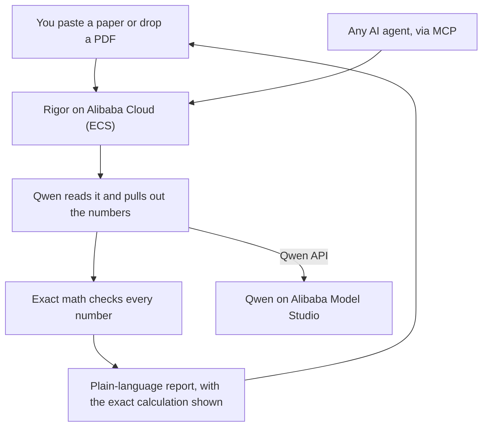

# Rigor

**An AI research-integrity referee.** Rigor reads a scientific paper, recomputes
every p-value and mean with exact math, cross-checks the sample sizes, and flags
where the paper's claims overstate its own numbers. In seconds. Free and open
source.

Built for the **author** (grad students, early-career and non-native-English
researchers) who wants to catch honest mistakes *before* submission, not the
publishers with big budgets that existing integrity tools serve.

- **Hackathon:** Global AI Hackathon Series with Qwen Cloud, Track 4 (Autopilot Agent)
- **Powered by:** Qwen (Alibaba Cloud Model Studio) for extraction; exact statistics for every verdict
- **Live demo (on Alibaba Cloud ECS):** http://47.236.166.20:8000

## Why it is not "just an AI wrapper"

The one question that separates a real tool from a wrapper: *if the LLM
hallucinates, does the product give a wrong answer?*

For Rigor, no. The language model's only job is **reading** messy prose and
pulling out structured numbers (`t(48) = 1.90, p < .001`). Every **verdict** is
produced by deterministic math and cannot be hallucinated. That is why Rigor
catches the errors *and leaves correct results alone*.

## What it checks

| Check | What it catches | Grounding |
|---|---|---|
| **p-value recomputation** | reported p disagrees with its test statistic (statcheck-style) | exact distributions (SciPy) |
| **GRIM** | arithmetically impossible means | pure arithmetic |
| **df vs N** | degrees of freedom that need more subjects than the study reports | pure arithmetic |
| **claim vs evidence** | conclusions that overstate the result (e.g. "significant" for a p that recomputed to n.s.) | grounded in the verified results |

Benchmark: **100% detection, 0% false positives** on a balanced 32-case set
(`python -m rigor.benchmark`). This is a proof-of-concept set, not a corpus;
scaling it to real papers is ongoing work.

## How it compares

The individual checks exist; doing all of them, on any paper, in plain language,
for the author is what is new.

| | Rigor | statcheck | Clear Skies / Wiley |
|---|:--:|:--:|:--:|
| Recompute p-values | yes | APA only | no |
| Impossible means (GRIM) | yes | no | no |
| df vs N cross-check | yes | no | no |
| Claim vs evidence (spin) | yes | no | no |
| Reads any prose / PDF | yes | rigid format | yes |
| Plain-language findings + fixes | yes | no | no |
| For the author, pre-submission | yes | yes | publisher, post-hoc |
| Callable by any agent (MCP) | yes | no | no |
| Free and open source | yes | yes | paid, closed |

## Quickstart

```bash
pip install -r requirements.txt
cp .env.example .env          # add your DASHSCOPE_API_KEY + workspace endpoint

# the deterministic core, no API key needed:
python -m rigor.demo_checks

# the full pipeline on a built-in demo paper:
python -m rigor.audit

# the accuracy benchmark:
python -m rigor.benchmark

# the unit tests (deterministic checks, no API key):
python -m pytest tests/ -q

# the web app:
uvicorn web.app:app --port 8000   # then open http://localhost:8000
```

## Agentic audit (not a pipeline)

Beyond the deterministic pipeline, Rigor ships a real **Qwen tool-calling agent**
(`rigor/agent.py`). Instead of a fixed flow, the model runs a multi-turn loop: it
*decides* what to check, *calls* the deterministic verification tools itself (it
never computes a verdict), *reasons* about each result, and *synthesises* whether
the problems are **systematic or isolated** - then writes a plain-language verdict.

```bash
python -m rigor.agent            # watch the agent call tools and reason
```

Also available in the web app (the "Run agent analysis" button) and as
`POST /api/agent`. This is the Track 4 "Autopilot Agent" shape: ambiguous input in,
tool use + reasoning + a human-readable judgement out, with a human-in-the-loop
review step before the report is finalised.

## Use Rigor from any AI agent (MCP)

Rigor ships an [MCP](https://modelcontextprotocol.io) server that exposes its
checks as tools, so any MCP client (Claude Desktop, an agent framework, another
Qwen agent) can fact-check statistics through Rigor and get a deterministic,
un-hallucinatable verdict.

```bash
python -m rigor.mcp_server        # stdio transport
```

Tools: `recompute_pvalue`, `grim_test`, `df_vs_n`, `audit_paper`. Example client
config (Claude Desktop):

```json
{ "mcpServers": { "rigor": { "command": "python", "args": ["-m", "rigor.mcp_server"] } } }
```

## Architecture



The model only reads. The math decides every verdict. That split is the whole design.
The reasoning behind each design choice is written up as short
[Architecture Decision Records](docs/adr/).

```
paper text / PDF
  -> ingest        (rigor/ingest.py)      text, PDF via PyMuPDF
  -> extract       (rigor/extract.py)     Qwen LLM -> structured stats/means/claims
  -> checks        (rigor/checks/)        statcheck + GRIM + df-vs-N (deterministic)
  -> claims        (rigor/claims.py)      claim-vs-evidence, grounded in the checks
  -> report        (rigor/report.py)      scored integrity report
web app            (web/app.py)           FastAPI + static landing page
```

## Tech stack

Python, FastAPI, SciPy, PyMuPDF, and Qwen via the OpenAI-compatible DashScope
endpoint. Deployable to Alibaba Cloud with the included `Dockerfile`.

## License

MIT. See [LICENSE](LICENSE).
