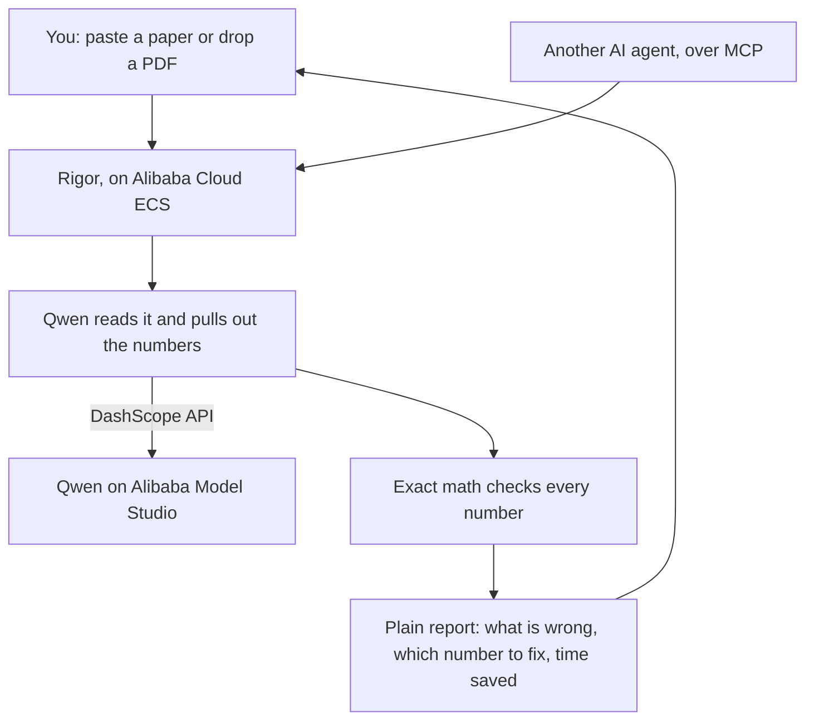

# Rigor

Rigor reads a research paper and checks whether its statistics actually add up. It
recomputes every p-value, tests whether the reported means and standard deviations
are even possible, checks the sample sizes against the degrees of freedom, and flags
places where the wording claims more than the numbers support. It does all of this in
seconds, and it is free and open source.

I built it for the person who needs it most and gets the least help today: the author
about to hit submit. The tools that already do this kind of screening are closed,
expensive, and sold to journals to run after a paper is submitted. Rigor runs before.

- **Hackathon:** Global AI Hackathon Series with Qwen Cloud, Track 4 (Autopilot Agent)
- **Powered by:** Qwen on Alibaba Cloud Model Studio for the reading, exact statistics
  for every verdict
- **Live demo (on Alibaba Cloud ECS):** http://47.236.166.20:8000

## What makes it strong

A quick tour of what is in here, and why each part matters.

- **It is not a wrapper, and you can prove it.** Turn the AI off and the math still
  scores 100 percent on 530 test cases.
- **Six checks, not one.** p-values, GRIM, GRIMMER, df-vs-N, effect size, and
  claim-vs-evidence. Several of these no other tool does.
- **It tells you which number to fix**, not just that something is wrong, and proves
  the fix by re-running the checks.
- **It puts each paper in context**, against the published field baseline, and
  estimates the time it just saved you.
- **It is a real agent.** Qwen decides what to check and calls the tools itself, and
  you can watch every step stream live.
- **It goes where you work.** A website, an installable CLI, a batch tool for a whole
  queue, a GitHub Action for every commit, and an MCP server for other agents.
- **It is honest about its one soft spot.** Reading can vary, so it can read a paper
  several times and show you how much the runs agreed.
- **It is built like a product.** 58 tests, continuous integration, a live status
  page, and a real deployment on Alibaba Cloud.
- **It never asks you to trust a number it cannot back.** Everything it shows is either
  computed from your paper or cited to a source.

The rest of this page walks through each of these. If you only read one more section,
read the next one.

## The one thing that makes it trustworthy

There is a fair question to ask of any AI tool: if the model makes something up, do
you get a wrong answer? For Rigor, no.

The model's only job is to read messy prose and pull the numbers out, turning a
sentence like `t(48) = 1.90, p < .001` into structured data. Every verdict after that
is plain arithmetic that cannot be hallucinated. You can prove it yourself: turn the
AI off and run the math engine over 530 test cases, and it still scores 100 percent.
The model reads. The math decides. That split is the whole design.

## What it checks

| Check | What it catches | How it knows |
|---|---|---|
| p-value recomputation | a reported p that disagrees with its own test statistic | exact distributions (SciPy) |
| GRIM | a mean that is arithmetically impossible for the sample size | pure arithmetic |
| GRIMMER | a standard deviation that is impossible for that mean and N | integer sum of squares plus parity |
| df vs N | degrees of freedom that need more subjects than the study reports | pure arithmetic |
| effect size | a reported Cohen's d that does not match its t-statistic | pure arithmetic |
| claim vs evidence | a conclusion that overstates the result it rests on | grounded in the verified numbers |

The GRIMMER, df-vs-N, and effect-size checks use only necessary conditions, so a flag
is always a real impossibility, never a guess. Rigor stays quiet when a paper is fine.

## How well it works

Two benchmarks, because they answer two different questions.

- **The math alone, no API key:** 530 injected-error cases with the answer known by
  construction. 100 percent precision and recall, runs offline in a second
  (`python -m rigor.benchmark_checks`). This is the proof that the verdict engine is
  correct on its own.
- **The full pipeline, with Qwen reading:** a balanced 32-case set, 100 percent
  detection and no false positives (`python -m rigor.benchmark`). A proof of concept.
  Scaling the validation to a large real-paper corpus is honest future work.

Because reading is the only step that can vary, Rigor can read a paper several times
and keep only the numbers the runs agree on, then show that agreement as a live score
(`RIGOR_EXTRACT_SAMPLES=3`). It turns the one uncertain step into a measured number.

## It tells you which number to fix

Most tools stop at "these numbers are inconsistent." Rigor goes one step further. A
paper's statistics are linked to each other: the sample size, the degrees of freedom,
the test statistic, the p-value, the mean, the SD. So when several checks fail, Rigor
looks for the single reported value whose correction would resolve the most of them,
and proves it by re-running the checks with that value substituted.

On the demo paper it says: *"One correction explains two findings. The stated sample
size N=10 is the likely typo; every flagged test fits once N is at least 49."* It is
shown as a hypothesis for you to confirm, never as a certainty. No other integrity
tool does this.

## It puts each paper in context

Every audit compares the paper you gave it against the published field baseline
(Nuijten et al. 2016, who ran statcheck over about 250,000 p-values). So instead of a
number in a vacuum, you see something like "two of three p-values inconsistent, above
the field average of about one in ten." It also estimates the time saved: how long a
hand recheck of those statistics would take, against the seconds Rigor took.

## How it compares

The individual checks already exist. Doing all of them, on any paper, in plain
language, for the author before submission, is what is new.

| | Rigor | statcheck | Clear Skies / Wiley |
|---|:--:|:--:|:--:|
| Recompute p-values | yes | APA only | no |
| Impossible means (GRIM) | yes | no | no |
| Impossible SDs (GRIMMER) | yes | no | no |
| df vs N cross-check | yes | no | no |
| Effect size vs t | yes | no | no |
| Claim vs evidence | yes | no | no |
| Points to the number to fix | yes | no | no |
| Reads any prose or PDF | yes | rigid format | yes |
| Plain-language findings and fixes | yes | no | no |
| Screens a whole submission queue | yes | no | yes |
| For the author, before submission | yes | yes | publisher, after |
| Callable by any AI agent (MCP) | yes | no | no |
| Free and open source | yes | yes | paid, closed |

## It is a real agent, not a fixed pipeline

Beyond the straight pipeline, Rigor runs Qwen as a genuine tool-calling agent
([rigor/agent.py](rigor/agent.py)). Instead of a fixed flow, the model decides what to
check, calls each deterministic tool itself, reasons about the results, and writes a
plain-language verdict on whether the problems look systematic or isolated. It never
computes a verdict; only the tools do. You can watch it work in the web app (the "Run
agent analysis" button streams every step) or call it at `POST /api/agent`.

This is the Track 4 shape end to end: ambiguous input in, tool use and reasoning and a
human-readable judgement out, with a human-in-the-loop review before anything is final.

## Use it from your own agent (MCP)

Rigor ships an [MCP](https://modelcontextprotocol.io) server, so any MCP client
(Claude Desktop, an agent framework, another Qwen agent) can call its checks as tools
and get a deterministic, un-hallucinatable verdict.

```bash
python -m rigor.mcp_server        # stdio transport
```

Tools: `recompute_pvalue`, `grim_test`, `grimmer_test`, `df_vs_n`, `cohens_d`,
`audit_paper`. Example Claude Desktop config:

```json
{ "mcpServers": { "rigor": { "command": "python", "args": ["-m", "rigor.mcp_server"] } } }
```

## Screen a whole submission queue

The same engine that audits one paper can screen a folder of them in one pass and hand
back a ranked, worst-first table. It also ships as a [GitHub Action](action.yml), so a
lab or journal can run integrity screening on every push and fail the build if any
paper scores too low:

```yaml
- uses: usv240/rigor@main
  with:
    path: manuscripts/
    min-score: "70"
    dashscope-api-key: ${{ secrets.DASHSCOPE_API_KEY }}
```

We ran it over 26 real published papers in a single pass. Recomputing all 62 reported
statistics by hand would take about three hours; Rigor did it in under six minutes and
narrowed the stack to the three papers that needed a human look. The paper it ranked
worst was the one we had independently verified. The honest write-up, including where
extraction gets noisy on long PDFs, is in [docs/corpus-run.md](docs/corpus-run.md).

## Quickstart

```bash
pip install .                 # installs the `rigor` command
cp .env.example .env          # add your DASHSCOPE_API_KEY and workspace endpoint

rigor demo                    # the deterministic checks, no API key needed
rigor audit paper.pdf         # audit one paper
rigor batch ./papers --csv out.csv --min-score 70
rigor serve                   # launch the web app, then open http://localhost:8000
```

Or run the pieces directly:

```bash
python -m rigor.benchmark_checks   # the 530-case math benchmark, no API key
python -m rigor.audit              # the full pipeline on a built-in demo paper
python -m rigor.agent              # watch the agent call tools and reason
python -m pytest tests/ -q         # the tests
```

## Architecture



The model only reads. The math decides every verdict. The reasoning behind each design
choice is written up as short [Architecture Decision Records](docs/adr/), and the full
system view is in [docs/architecture.md](docs/architecture.md).

```
paper text or PDF
  -> ingest      (rigor/ingest.py)      text, or PDF via PyMuPDF
  -> extract     (rigor/extract.py)     Qwen turns prose into structured numbers
                                        (with optional multi-run reconciliation)
  -> checks      (rigor/checks/)        statcheck, GRIM, GRIMMER, df-vs-N, effect size
  -> claims      (rigor/claims.py)      claim-vs-evidence, grounded in the checks
  -> report      (rigor/report.py)      scored report, localization, field comparison
batch            (rigor/batch.py)       audit a whole folder into a triage table
agent            (rigor/agent.py)       Qwen tool-calling loop over the checks
mcp server       (rigor/mcp_server.py)  the checks as tools for any MCP client
web app          (web/app.py)           FastAPI plus the landing page
```

## What it does not do, on purpose

Rigor checks what it can prove from the reported numbers. It does not judge whether the
raw data was fabricated, whether a figure was manipulated, or whether the chosen method
was appropriate. Those are real problems, but they need different tools and different
data, and answering them with an AI guess would throw away the one thing that makes
Rigor trustworthy. The [roadmap](docs/architecture.md) covers what comes next, all of
it within the same provable approach.

## Tech stack

Python, FastAPI, SciPy, PyMuPDF, and Qwen through the OpenAI-compatible DashScope
endpoint. Containerized with the included `Dockerfile` and deployed on Alibaba Cloud
ECS.

## License

MIT. See [LICENSE](LICENSE).
