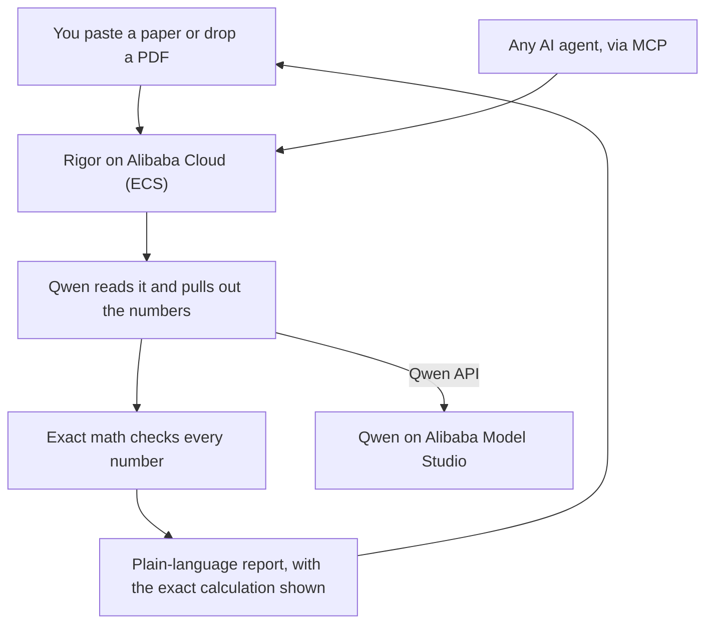

# Rigor

**An agent that automates the statistical-integrity screening step of the
manuscript-submission workflow.** Point Rigor at a paper — or a whole submission
queue — and it reads the prose, recomputes every p-value, mean, and standard
deviation with exact math, cross-checks the sample sizes, and flags where the
claims overstate the numbers. The check that journals run by hand, or pay closed
tools like Clear Skies for, done in seconds, open source, and available to the
**author** before they ever hit submit.

This is the Track 4 "Autopilot Agent" shape end to end: ambiguous real-world input
(free-form papers, messy PDFs) → tool invocation (deterministic verification tools)
→ a human-in-the-loop checkpoint (dismiss false positives) → a finalized report,
with the whole thing callable as a batch pipeline or by other agents over MCP.

- **Hackathon:** Global AI Hackathon Series with Qwen Cloud, Track 4 (Autopilot Agent)
- **Powered by:** Qwen (Alibaba Cloud Model Studio) for extraction; exact statistics for every verdict
- **Live demo (on Alibaba Cloud ECS):** http://47.236.166.20:8000

## Why it is not "just an AI wrapper"

The one question that separates a real tool from a wrapper: *if the LLM
hallucinates, does the product give a wrong answer?*

For Rigor, no. The language model's only job is **reading** messy prose and
pulling out structured numbers (`t(48) = 1.90, p < .001`). Every **verdict** is
produced by deterministic math and cannot be hallucinated. That is why Rigor
catches the errors *and leaves correct results alone*.

## What it checks

| Check | What it catches | Grounding |
|---|---|---|
| **p-value recomputation** | reported p disagrees with its test statistic (statcheck-style) | exact distributions (SciPy) |
| **GRIM** | arithmetically impossible means | pure arithmetic |
| **GRIMMER** | arithmetically impossible standard deviations | integer sum-of-squares + parity |
| **df vs N** | degrees of freedom that need more subjects than the study reports | pure arithmetic |
| **effect size** | a reported Cohen's d that disagrees with its t-statistic | pure arithmetic |
| **claim vs evidence** | conclusions that overstate the result (e.g. "significant" for a p that recomputed to n.s.) | grounded in the verified results |

Every deterministic verdict is a *provable* one: the GRIMMER, df-vs-N, and
effect-size checks use only necessary conditions, so a flag is never a false alarm.

**Two benchmarks:**

- **Deterministic core (no API key, instant, reproducible):** 530 injected-error
  cases with ground truth by construction — **100% precision and recall across all
  five checks** (`python -m rigor.benchmark_checks`). This isolates and proves the
  math that produces every verdict.
- **End-to-end (needs Qwen):** the full LLM-extraction + checks pipeline over a
  balanced 32-case set, 100% detection / 0% false positives (`python -m
  rigor.benchmark`). A proof of concept; scaling it to a large real-paper corpus is
  ongoing work.

Because extraction is the only non-deterministic step, Rigor can run it several
times and **reconcile the results by majority vote**, reporting a live *extraction
agreement* score and a per-finding confidence — turning that one source of
uncertainty into a measured number (`RIGOR_EXTRACT_SAMPLES=3`).

## Beyond detection: it tells you *which number to fix*

Every other tool stops at "these numbers are inconsistent." Rigor goes one step
further and **localizes the likely error**. A paper's statistics are an
over-determined constraint system (N, df, statistic, p, mean, SD are all linked), so
Rigor searches for the *single reported value whose correction resolves the most
findings* — a minimum-repair search over that constraint graph
([rigor/localize.py](rigor/localize.py)).

On the demo paper it reports: *"One correction explains 2 findings — the stated
sample size N=10 is the likely typo; every flagged test's df is consistent once
N ≥ 49."* Each repair is **verified by re-running the checks**, and presented as a
parsimony-ranked *hypothesis* for the reviewer, never a certainty. No other
integrity tool does this.

## How it compares

The individual checks exist; doing all of them, on any paper, in plain language,
for the author is what is new.

| | Rigor | statcheck | Clear Skies / Wiley |
|---|:--:|:--:|:--:|
| Recompute p-values | yes | APA only | no |
| Impossible means (GRIM) | yes | no | no |
| Impossible SDs (GRIMMER) | yes | no | no |
| df vs N cross-check | yes | no | no |
| Effect-size (d vs t) check | yes | no | no |
| Claim vs evidence (spin) | yes | no | no |
| **Localizes the likely error** (which number to fix) | yes | no | no |
| Reads any prose / PDF | yes | rigid format | yes |
| Plain-language findings + fixes | yes | no | no |
| Batch a submission queue | yes | no | yes |
| For the author, pre-submission | yes | yes | publisher, post-hoc |
| Callable by any agent (MCP) | yes | no | no |
| Free and open source | yes | yes | paid, closed |

## Quickstart

```bash
pip install .                 # installs the `rigor` command (or: pip install -r requirements.txt)
cp .env.example .env          # add your DASHSCOPE_API_KEY + workspace endpoint

# once installed, one command does everything:
rigor demo                    # deterministic checks, no API key
rigor audit paper.pdf         # audit one paper
rigor batch ./submissions --csv out.csv --min-score 70
rigor serve                   # launch the web app

# or run the modules directly, no install:
# the deterministic core, no API key needed:
python -m rigor.demo_checks

# the deterministic-core accuracy benchmark (530 cases, no API key):
python -m rigor.benchmark_checks

# the full pipeline on a built-in demo paper:
python -m rigor.audit

# audit a whole folder of papers -> triage table + CSV/JSON (editorial workflow):
python -m rigor.batch ./submissions --csv out.csv

# the end-to-end accuracy benchmark (needs Qwen):
python -m rigor.benchmark

# the unit tests (deterministic checks, no API key):
python -m pytest tests/ -q

# the web app:
uvicorn web.app:app --port 8000   # then open http://localhost:8000
```

## Agentic audit (not a pipeline)

Beyond the deterministic pipeline, Rigor ships a real **Qwen tool-calling agent**
(`rigor/agent.py`). Instead of a fixed flow, the model runs a multi-turn loop: it
*decides* what to check, *calls* the deterministic verification tools itself (it
never computes a verdict), *reasons* about each result, and *synthesises* whether
the problems are **systematic or isolated** - then writes a plain-language verdict.

```bash
python -m rigor.agent            # watch the agent call tools and reason
```

Also available in the web app (the "Run agent analysis" button) and as
`POST /api/agent`. This is the Track 4 "Autopilot Agent" shape: ambiguous input in,
tool use + reasoning + a human-readable judgement out, with a human-in-the-loop
review step before the report is finalised.

## Use Rigor from any AI agent (MCP)

Rigor ships an [MCP](https://modelcontextprotocol.io) server that exposes its
checks as tools, so any MCP client (Claude Desktop, an agent framework, another
Qwen agent) can fact-check statistics through Rigor and get a deterministic,
un-hallucinatable verdict.

```bash
python -m rigor.mcp_server        # stdio transport
```

Tools: `recompute_pvalue`, `grim_test`, `grimmer_test`, `df_vs_n`, `cohens_d`,
`audit_paper`. Example client config (Claude Desktop):

```json
{ "mcpServers": { "rigor": { "command": "python", "args": ["-m", "rigor.mcp_server"] } } }
```

## Screen a manuscript on every commit (GitHub Action)

Rigor ships a composite **GitHub Action** ([action.yml](action.yml)) so a lab or
journal can drop integrity screening into CI — every push runs Rigor over the papers
in the repo, uploads a CSV/JSON report, and can fail the build if any paper scores
below a threshold:

```yaml
- uses: usv240/rigor@main
  with:
    path: manuscripts/
    min-score: "70"
    dashscope-api-key: ${{ secrets.DASHSCOPE_API_KEY }}
```

This is the editorial-workflow shape as infrastructure: the same batch engine
(`rigor batch`, [rigor/batch.py](rigor/batch.py)) that triages a submission queue,
wired to run automatically. We ran it over **26 real published papers** in one pass —
including an honest account of extraction variance on long PDFs — in
[docs/corpus-run.md](docs/corpus-run.md).

## Architecture



The model only reads. The math decides every verdict. That split is the whole design.
The reasoning behind each design choice is written up as short
[Architecture Decision Records](docs/adr/).

```
paper text / PDF
  -> ingest        (rigor/ingest.py)      text, PDF via PyMuPDF
  -> extract       (rigor/extract.py)     Qwen LLM -> structured stats/means/claims
                                          (+ optional multi-run reconciliation)
  -> checks        (rigor/checks/)        statcheck + GRIM + GRIMMER + df-vs-N
                                          + effect-size (all deterministic)
  -> claims        (rigor/claims.py)      claim-vs-evidence, grounded in the checks
  -> report        (rigor/report.py)      scored integrity report + confidence
batch              (rigor/batch.py)       audit a whole folder -> CSV/JSON triage
agent              (rigor/agent.py)       Qwen tool-calling loop over the checks
mcp server         (rigor/mcp_server.py)  checks as tools for any MCP client
web app            (web/app.py)           FastAPI + static landing page
```

## Tech stack

Python, FastAPI, SciPy, PyMuPDF, and Qwen via the OpenAI-compatible DashScope
endpoint. Deployable to Alibaba Cloud with the included `Dockerfile`.

## License

MIT. See [LICENSE](LICENSE).
