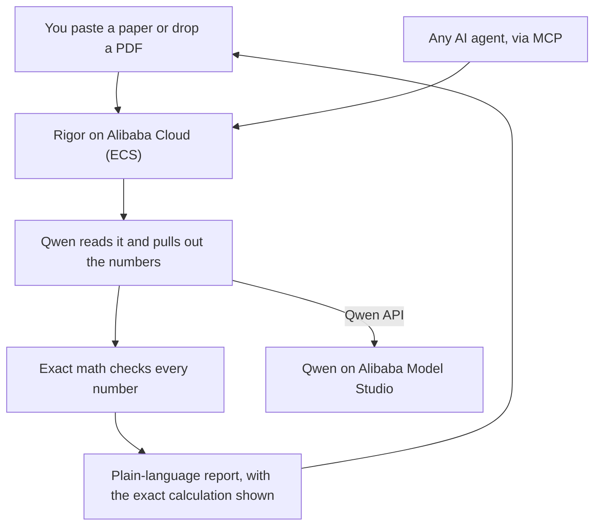

# Architecture Decision Records (ADRs)

Short notes on the main design choices behind Rigor, and why we made them. Each one
takes about a minute to read.

## The idea everything rests on

Rigor uses an AI model to **read**, and exact math to **judge**. The model never
decides whether a number is right or wrong. That is what keeps the results trustworthy.

## The records

- [0001 - The model reads, the math judges](0001-model-reads-math-judges.md)
- [0002 - Use Qwen function calling to extract](0002-qwen-function-calling.md)
- [0003 - Make it an agent, not a pipeline](0003-agent-not-pipeline.md)
- [0004 - Keep a human in the loop](0004-human-in-the-loop.md)
- [0005 - Deploy on Alibaba Cloud ECS with Docker](0005-deploy-on-alibaba-ecs.md)
- [0006 - Expose the checks as an MCP server](0006-mcp-server.md)

The full system view is in [../architecture.md](../architecture.md).
