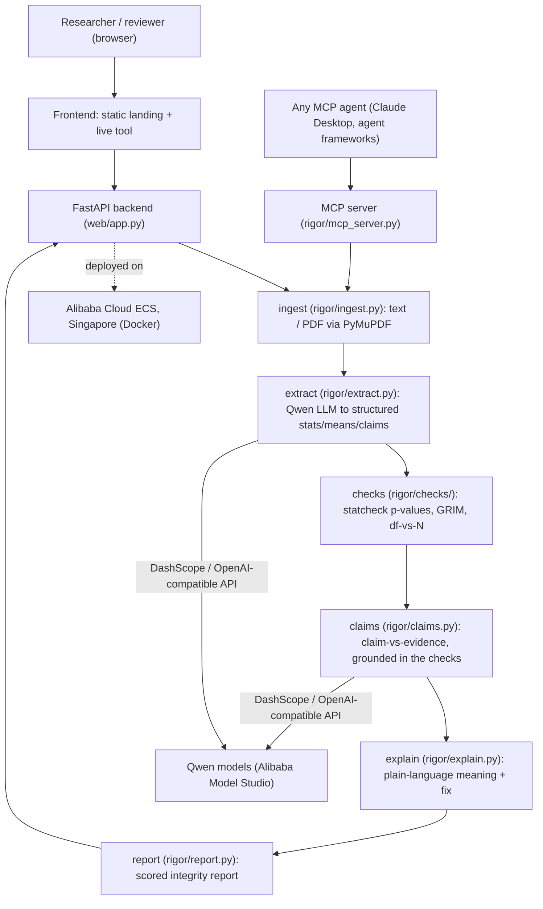

# Rigor - architecture

## Overview

Rigor reads a scientific paper, extracts its reported statistics with a Qwen
language model, and then verifies each one with exact, deterministic math. The
language model only reads; every verdict is arithmetic, so it cannot be
hallucinated.

## Components

| Layer | Module | Responsibility |
|---|---|---|
| Frontend | `web/static/` | Landing page, live tool, filterable report, info tooltips |
| API | `web/app.py` | FastAPI: serves the site, `/api/audit`, `/api/audit/pdf`, `/api/agent`, `/api/agent/stream` |
| Ingest | `rigor/ingest.py` | Load text or extract PDF text (PyMuPDF) |
| Extract | `rigor/extract.py` | Qwen LLM turns prose into structured statistics/means/claims |
| Checks | `rigor/checks/` | Deterministic verdicts: `statcheck.py`, `grim.py`, `consistency.py` |
| Claims | `rigor/claims.py` | Claim-vs-evidence, grounded in the verified results |
| Explain | `rigor/explain.py` | Plain-language "what it means" + "what to do" |
| Report | `rigor/report.py` | Scoring, severity grouping, JSON/text output |
| MCP | `rigor/mcp_server.py` | Exposes the checks as tools any AI agent can call |

## Why the LLM cannot corrupt the result

The only non-deterministic step is extraction. Every verdict is computed by
`rigor/checks/` (exact SciPy distributions and arithmetic). If the extractor
misreads a number, the worst case is a missed or spurious flag on that one
statistic; it can never invent a wrong verdict, because the model never produces
a verdict. This is what separates Rigor from an "AI wrapper".

## Alibaba Cloud usage

- **Qwen models** via **Alibaba Cloud Model Studio** (DashScope, OpenAI-compatible
  endpoint) power extraction and the claim-vs-evidence analysis. See
  [`rigor/llm.py`](../rigor/llm.py).
- The backend runs on **Alibaba Cloud ECS** (Singapore region), containerized with
  the repo `Dockerfile`.
