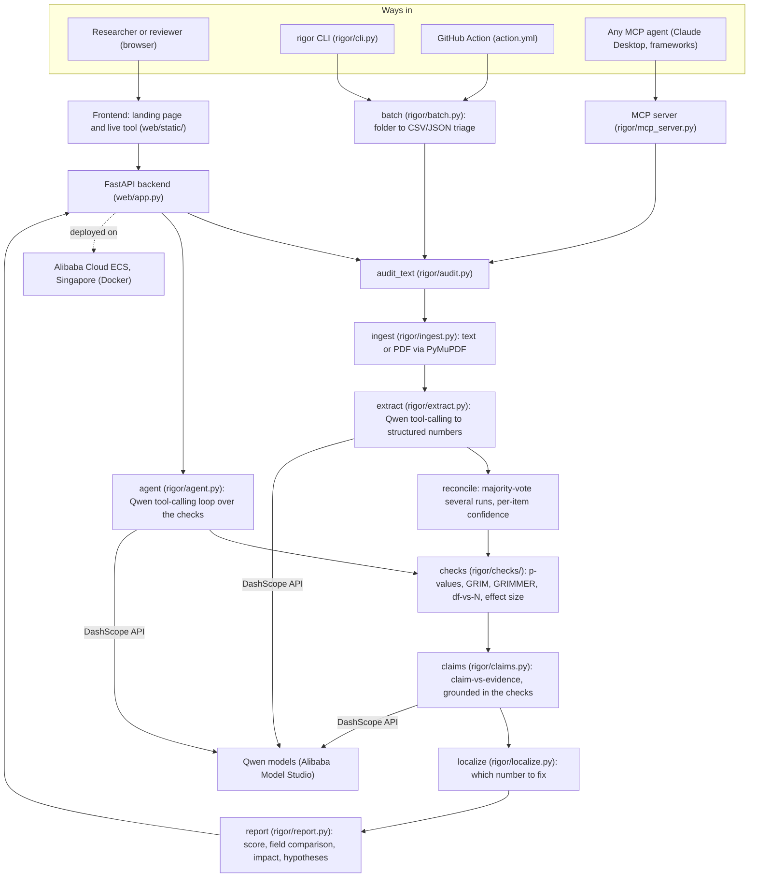

# How Rigor is built

Rigor reads a paper with Qwen, then checks every number it found with exact math. The
model only reads; the math renders every verdict, so nothing you see is a guess. On top
of the checks, it does two things no other tool does: it points to the single number
most likely at fault, and it puts each paper next to the published field baseline. The
same core runs as a website, an installable command, a batch tool, a GitHub Action, an
MCP server, and a real tool-calling agent.

## The pieces

| Layer | Module | What it does |
|---|---|---|
| Frontend | `web/static/` | Landing page, live tool, collapsible and filterable report, root-cause callout, live status bar, light and dark themes |
| API | `web/app.py` | FastAPI: serves the site and `/api/audit`, `/api/audit/pdf`, `/api/agent`, `/api/agent/stream`, `/api/samples`, `/api/status`, `/api/version`, `/health`; per-IP rate limiting and audit logging |
| CLI | `rigor/cli.py` | The installed `rigor` command: `audit`, `batch`, `agent`, `demo`, `benchmark`, `serve` |
| Batch | `rigor/batch.py` | Audit a whole folder into a worst-first CSV/JSON triage, with a `--min-score` gate and an aggregate time-saved summary |
| GitHub Action | `action.yml` | Screen manuscripts on every push; uploads the report, can fail the build below a threshold |
| Ingest | `rigor/ingest.py` | Load text, or pull text out of a PDF with PyMuPDF |
| Extract | `rigor/extract.py` | Qwen tool-calling turns prose into structured statistics and means; optional multi-run reconciliation with a confidence score |
| Checks | `rigor/checks/` | The deterministic verdicts: `statcheck.py`, `grim.py`, `grimmer.py`, `consistency.py` (df-vs-N), `effectsize.py` |
| Claims | `rigor/claims.py` | Claim-vs-evidence, grounded in the results the math already verified |
| Localize | `rigor/localize.py` | The minimum-repair search: which single number, if corrected, resolves the most findings |
| Report | `rigor/report.py` | Scoring, the field-baseline comparison, the time-saved estimate, root-cause hypotheses, JSON and text output |
| Agent | `rigor/agent.py` | The Qwen tool-calling loop: decides what to check, calls the tools, writes a verdict |
| MCP | `rigor/mcp_server.py` | The checks as tools any AI agent can call |
| LLM client | `rigor/llm.py` | A thin Qwen (DashScope) client with timeouts, retries, and token-usage logging |

## The six checks, all deterministic

| Check | Module | Catches |
|---|---|---|
| p-value recomputation | `checks/statcheck.py` | a reported p that disagrees with its test statistic |
| GRIM | `checks/grim.py` | a mean that is arithmetically impossible for the sample size |
| GRIMMER | `checks/grimmer.py` | an impossible standard deviation (integer sum of squares plus parity) |
| df-vs-N | `checks/consistency.py` | degrees of freedom that need more subjects than the study reports |
| effect size | `checks/effectsize.py` | a reported Cohen's d that does not match its t |
| claim vs evidence | `claims.py` | a conclusion that overstates the verified numbers |

GRIMMER, df-vs-N, and effect size use only necessary conditions, so a flag is a proof,
never a false alarm.

## Why the model cannot corrupt the result

The only step that is not deterministic is reading. Every verdict is computed by
`rigor/checks/` with exact distributions and arithmetic. If the reader misreads a
number, the worst that happens is a missed or spurious flag on that one statistic. It
can never invent a wrong verdict, because the model never produces a verdict. To measure
and shrink that one risk, extraction can run several times and keep only what the runs
agree on, reporting a live agreement score ([ADR 0007](adr/0007-extraction-reconciliation.md)).

## How we know it works

- **The math on its own**, no API key: `rigor/benchmark_checks.py` runs 530 cases with
  the answer known by construction and scores 100 percent, offline and reproducible.
- **The full pipeline**, with Qwen reading: `rigor/benchmark.py` on a balanced 32-case
  set.

A run over 26 real published papers, with an honest account of where extraction gets
noisy on long PDFs, is in [corpus-run.md](corpus-run.md).

## Where it goes next

The path forward is more provable checks, not an AI that guesses.

Within the same deterministic core:

- recompute the test statistic itself from the reported means, SDs, and Ns
- more test types and one-tailed detection
- confidence interval, point estimate, and standard error consistency
- sample-size consistency across a whole paper
- scale the validation to a large corpus of retracted and corrected papers

Out of scope on purpose, because they are different problems that need different tools:
data-fabrication detection through digit analysis, image and figure forensics, and
method-validity checks. We name these rather than pretend to cover them. A tool that
claims to catch every error is either dishonest or an unreliable oracle, and Rigor stays
provable.

## The design decisions

Each major choice has a short write-up in [docs/adr/](adr/):

- 0001, the model reads, the math judges
- 0002, Qwen function calling for extraction
- 0003, an agent, not a pipeline
- 0004, a human in the loop
- 0005, deploy on Alibaba Cloud ECS
- 0006, expose the checks as an MCP server
- 0007, reconcile several extractions and report the agreement
- 0008, localize the error, not just detect it
- 0009, ship an adoption surface (CLI, batch, GitHub Action)
- 0010, show impact, but only with numbers we can cite or compute

## Where Alibaba Cloud comes in

- **Qwen**, through **Alibaba Cloud Model Studio** (the DashScope OpenAI-compatible
  endpoint), does the reading in three places: extraction, the claim-vs-evidence
  analysis, and the agent loop. See [`rigor/llm.py`](../rigor/llm.py).
- The backend runs on **Alibaba Cloud ECS** in Singapore, containerized with the repo
  `Dockerfile`. The live `/api/status` endpoint reports when Qwen and the host are up.
