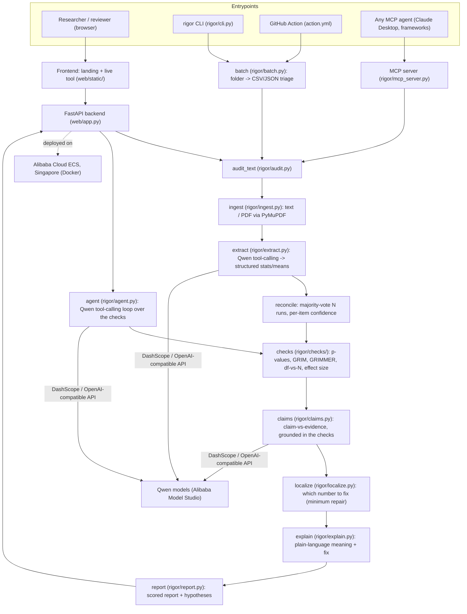

# Rigor - architecture

## Overview

Rigor reads a scientific paper, extracts its reported statistics with a Qwen
language model, and then verifies each one with exact, deterministic math. The
language model only reads; every verdict is arithmetic, so it cannot be
hallucinated. Beyond detecting errors, Rigor **localizes** the single number most
likely at fault, and it runs as a website, an installable CLI, a batch tool, a
GitHub Action, an MCP server, and a genuine tool-calling agent.

## Components

| Layer | Module | Responsibility |
|---|---|---|
| Frontend | `web/static/` | Landing page, live tool, collapsible/filterable report, root-cause callout, info tooltips, light/dark |
| API | `web/app.py` | FastAPI: serves the site, `/api/audit`, `/api/audit/pdf`, `/api/agent`, `/api/agent/stream`; per-IP rate limiting + audit logging |
| CLI | `rigor/cli.py` | Installed `rigor` command: `audit` / `batch` / `agent` / `demo` / `benchmark` / `serve` |
| Batch | `rigor/batch.py` | Audit a whole folder -> worst-first CSV/JSON triage, with a `--min-score` CI gate |
| GitHub Action | `action.yml` | Screen manuscripts on every commit; uploads the report, can fail the build below a threshold |
| Ingest | `rigor/ingest.py` | Load text or extract PDF text (PyMuPDF) |
| Extract | `rigor/extract.py` | Qwen tool-calling turns prose into structured statistics/means; optional multi-run reconciliation + confidence |
| Checks | `rigor/checks/` | Deterministic verdicts: `statcheck.py` (p-values), `grim.py`, `grimmer.py`, `consistency.py` (df-vs-N), `effectsize.py` (Cohen's d) |
| Claims | `rigor/claims.py` | Claim-vs-evidence, grounded in the verified results |
| Localize | `rigor/localize.py` | Minimum-repair search: which single reported number, if corrected, resolves the most findings |
| Explain | `rigor/explain.py` | Plain-language "what it means" + "what to do" |
| Report | `rigor/report.py` | Scoring, severity grouping, root-cause hypotheses, extraction metadata, JSON/text output |
| Agent | `rigor/agent.py` | Qwen tool-calling loop: decides what to check, calls the deterministic tools, synthesises a verdict |
| MCP | `rigor/mcp_server.py` | Exposes the checks as tools any AI agent can call (`recompute_pvalue`, `grim_test`, `grimmer_test`, `df_vs_n`, `cohens_d`, `audit_paper`) |
| LLM client | `rigor/llm.py` | Thin DashScope (Qwen) client with timeout/retries and token-usage logging |

## The six checks (all deterministic, un-hallucinatable)

| Check | Module | Catches |
|---|---|---|
| p-value recomputation | `checks/statcheck.py` | reported p disagrees with its test statistic |
| GRIM | `checks/grim.py` | arithmetically impossible means |
| GRIMMER | `checks/grimmer.py` | arithmetically impossible standard deviations (integer sum-of-squares + parity) |
| df-vs-N | `checks/consistency.py` | degrees of freedom needing more subjects than the study reports |
| effect size | `checks/effectsize.py` | a reported Cohen's d that disagrees with its t |
| claim vs evidence | `claims.py` | conclusions that overstate the verified numbers (LLM-flagged, human-review tier) |

GRIMMER, df-vs-N, and effect size use only *necessary* conditions, so a flag is a
proof, never a false alarm.

## Why the LLM cannot corrupt the result

The only non-deterministic step is extraction. Every verdict is computed by
`rigor/checks/` (exact SciPy distributions and arithmetic). If the extractor
misreads a number, the worst case is a missed or spurious flag on that one
statistic; it can never invent a wrong verdict, because the model never produces
a verdict. To quantify and reduce that one risk, extraction can run several times
and **reconcile by majority vote**, reporting a live agreement score and per-finding
confidence ([ADR 0007](adr/0007-extraction-reconciliation.md)).

## Two evaluations

- **Deterministic core** (`rigor/benchmark_checks.py`): 530 injected-error cases with
  ground truth by construction, 100% precision/recall across all five math checks,
  offline and reproducible with no API key.
- **End-to-end** (`rigor/benchmark.py`): the full LLM-extraction + checks pipeline on
  a balanced 32-case set.

A corpus run over 26 real papers, with an honest account of extraction variance on
long PDFs, is in [corpus-run.md](corpus-run.md).

## Design decisions

Each major choice is recorded as a short ADR in [docs/adr/](adr/):

- 0001 - the model reads, the math judges
- 0002 - Qwen function calling for extraction
- 0003 - an agent, not a pipeline
- 0004 - human in the loop
- 0005 - deploy on Alibaba Cloud ECS
- 0006 - expose the checks as an MCP server
- 0007 - reconcile several extractions, report the agreement
- 0008 - localize the error, don't just detect it
- 0009 - ship an adoption surface (CLI, batch, GitHub Action)

## Alibaba Cloud usage

- **Qwen models** via **Alibaba Cloud Model Studio** (DashScope, OpenAI-compatible
  endpoint) power extraction, the claim-vs-evidence analysis, and the agent loop. See
  [`rigor/llm.py`](../rigor/llm.py).
- The backend runs on **Alibaba Cloud ECS** (Singapore region), containerized with
  the repo `Dockerfile`.
